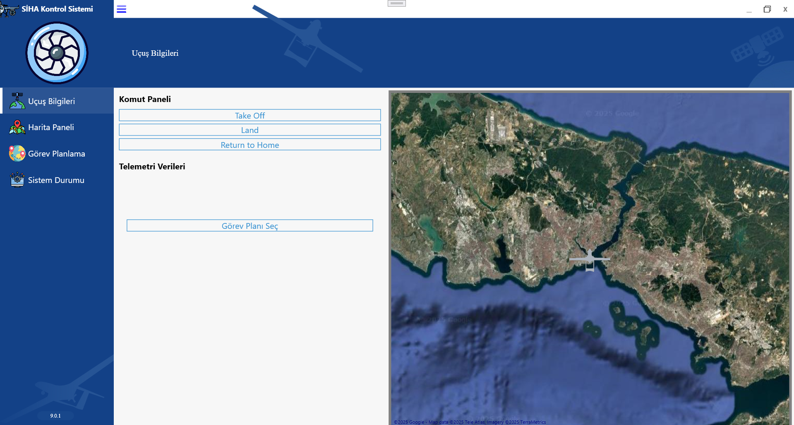
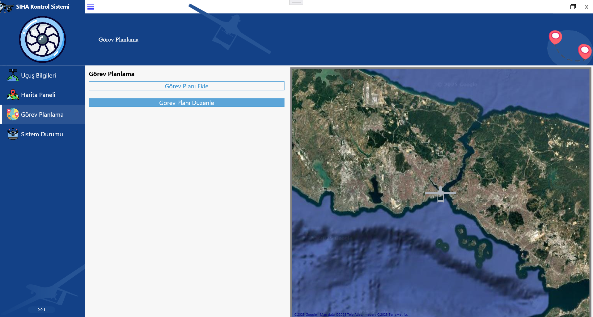

## Uygulama Görüntüleri

### 1. Flight Information Page

### 2. Take Off SIHA

### 3. Map Panel Page

### 4. Duty Planning

### 5. Task Plan Adding Window

### 6. Aim Coordinate Selecting Window

### 7. Full Screen Views

